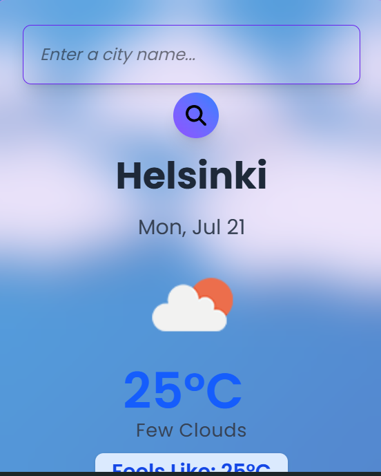

<div align="center">

# React Weather App

<p>
  
  
  
  
  <a href="https://react-weather-app-indol-five.vercel.app" target="_blank" rel="noopener noreferrer">
    
  </a>
</p>

<p>
  A simple and elegant weather application built with React, providing real-time weather data and a 5-day forecast for any city.
</p>

<p align="center">
  <a href="https://react-weather-app-indol-five.vercel.app/" target="_blank" rel="noopener noreferrer"><strong>Check out the live demo »</strong></a>
</p>

</div>

## ✨ Features

- **Current Weather:** Get the current temperature, humidity, wind speed, and weather conditions.
- **5-Day Forecast:** View the weather forecast for the next 5 days.
- **Search:** Search for any city to get its weather data.
- **Responsive Design:** The application is fully responsive and works on all devices.

## 🛠️ Tech Stack

- **Frontend:** [React](https://reactjs.org/), [Tailwind CSS](https://tailwindcss.com/)
- **Build Tool:** [Vite](https://vitejs.dev/)
- **Deployment:** [Vercel](https://vercel.com/)

## 📸 Screenshots

### Desktop


### Mobile



## 🚀 Getting Started

To get a local copy up and running, follow these simple steps.

### Prerequisites

- Node.js (v18.18.0 or higher)
- npm (v9.0.0 or higher)

### Installation

1.  Clone the repo
    ```sh
    git clone https://github.com/viboverse/react-weather-app.git
    ```
2.  Install NPM packages
    ```sh
    npm install
    ```
3.  Start the development server
    ```sh
    npm run dev
    ```

## 🙏 Acknowledgments

- [OpenWeatherMap API](https://openweathermap.org/api) for providing the weather data.
- [Shields.io](https://shields.io/) for the badges.
- [Vercel](https://vercel.com/) for hosting.
