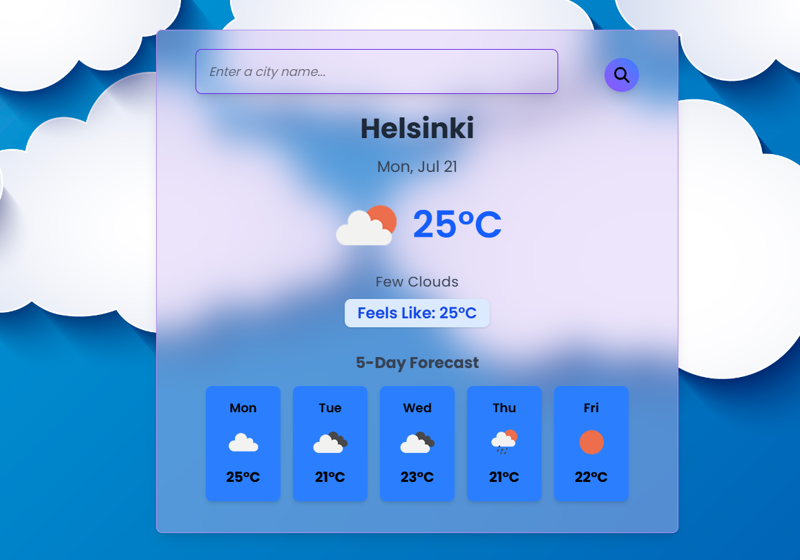

<div align="center">

# React Weather App

<p>
  
  
  
  
  
  
  
  
  <a href="https://react-weather-app-vtjz.vercel.app/" target="_blank" rel="noopener noreferrer">
    
  </a>
</p>

<p>
  Fast, minimal weather app built with <strong>React</strong> and <strong>Vite</strong>, styled with <strong>Tailwind CSS</strong> and animated using <strong>Motion</strong>. It shows the current conditions and a 5‑day forecast from OpenWeatherMap. Runs on <strong>Node 18+</strong> and is deployed on <strong>Vercel</strong>.
</p>

<p align="center">
  <a href="https://react-weather-app-vtjz.vercel.app/" target="_blank" rel="noopener noreferrer"><strong>Live demo »</strong></a>
</p>

</div>

## ✨ Features

- Current weather: temperature, humidity, wind, and conditions
- 5‑day forecast with daily breakdown
- City search with friendly errors
- Responsive layout with subtle animations

## 🛠️ Tech stack (versions)

- React 19.1.0
- Tailwind CSS 4.1.11
- Motion 12.23.6 (Framer Motion for React 19)
- Vite 7.0.4
- Tooling: ESLint 9.31.0, Prettier 3.6.2
- Runtime: Node 18.18.0+, npm 9.0.0+

## 🚀 Installation

Prerequisites

- Node.js 18.18.0 or newer
- An OpenWeatherMap API key

Clone and run

```powershell
# Clone
git clone https://github.com/viboverse/react-weather-app.git
cd react-weather-app

# Install deps
npm install

# Configure environment
# Create .env and add your API key
"VITE_API_KEY=YOUR_OPENWEATHER_API_KEY" | Out-File -Encoding utf8 .env

# Start dev server
npm run dev
```

Build and preview

```powershell
npm run build
npm run preview
```

## 📸 Screenshots



## 🙏 Acknowledgments

- OpenWeatherMap API for weather data
- Shields.io for the badges
- Vercel for hosting

---

**Built by [Vahab Afsharian](https://github.com/viboverse)**
